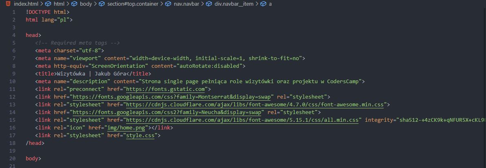
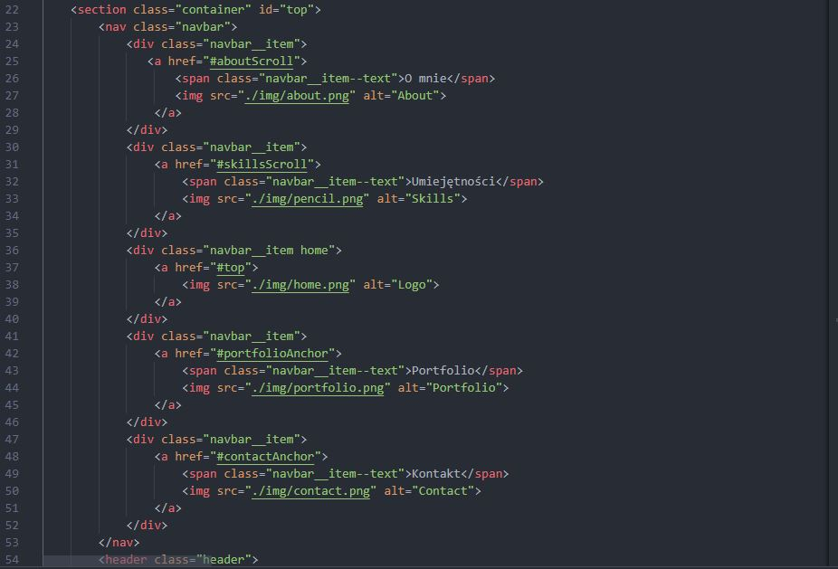
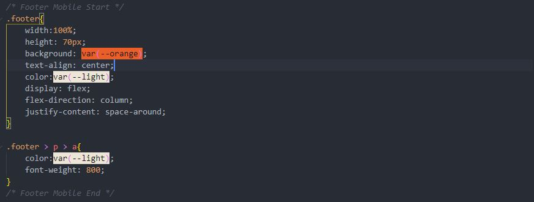
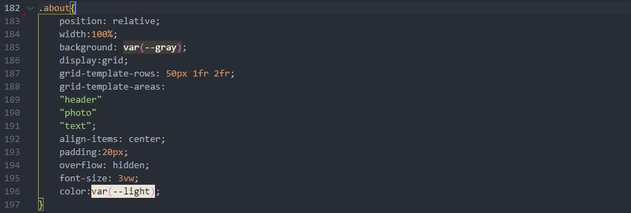
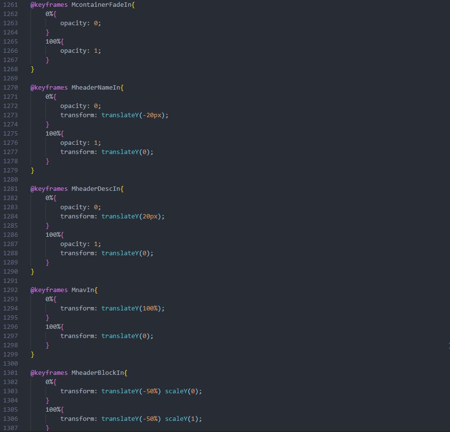
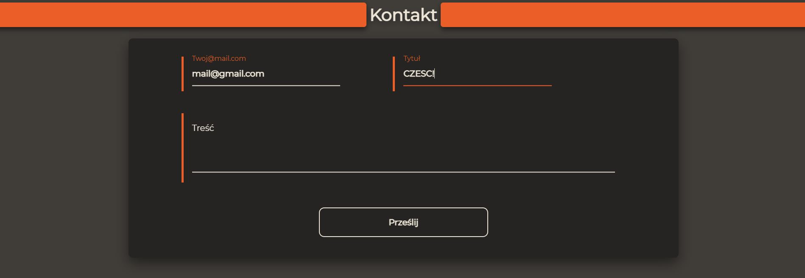

# CodersCamp 2020 - Jakub Góra - Projekt HTML & CSS

## Wymagane zagadnienia:

* Box-model

Cała strona jest oparta na elementach box-modelu. Praktycznie każdy element ma ustalony **margin** , **padding**, **border**, **width** oraz **height**.


* Kaskadowość CSS oraz podpinanie CSSa do HTMLa, zarówno lokalnego jak i zewnętrznego

Na stronie zostały zachowane zasady kaskadowości stylów CSS, dlatego też nigdzie nie dochodzi do konfliktów oraz problemów ze stylowaniem elementów. Wszystkie style zostały prawidłowo podpięte,wewnętrzny arkusz jak i zewnętrzne arkusze. 



* Selektory CSS

W arkuszu stylów zastosowane zostały zróżnicowane selektory CSS.


* Popularne tagi HTML

Strona jest zbudowana na mieszance tagów HTMLa 5 jak i starszej wersji HTMLa



* Stylowanie tekstu oraz zapisywanie kolorów

Na stronie kolory zostały zaimplementowane za pomocą zapisu szestnastkowego przypisanego do zmiennej globalnej. Stylowanie tekstu zostało zrealizowane praktycznie w każdym elemencie, w którym występuje tekst.



* Flexbox/Grid oraz position: relative/absolute

Większość elementów na stronie używa display: flex lub grid. Position: relative / absolute zazwyczaj była stosowana do pseudoelementów **::before** i **::after** ale nie tylko.



* Animacje keyframes

Strona wykorzystuje animacje keyframes.



* Formularz 

Strona posiada formularz kontaktowy. (Nie działający)



* Responsive Web Design

RWD zostało zrealizowane za pomocą media queries. 

```
$ @media (min-width: 1024px){...}
```


